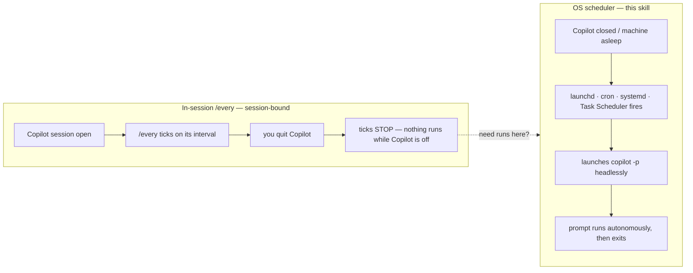
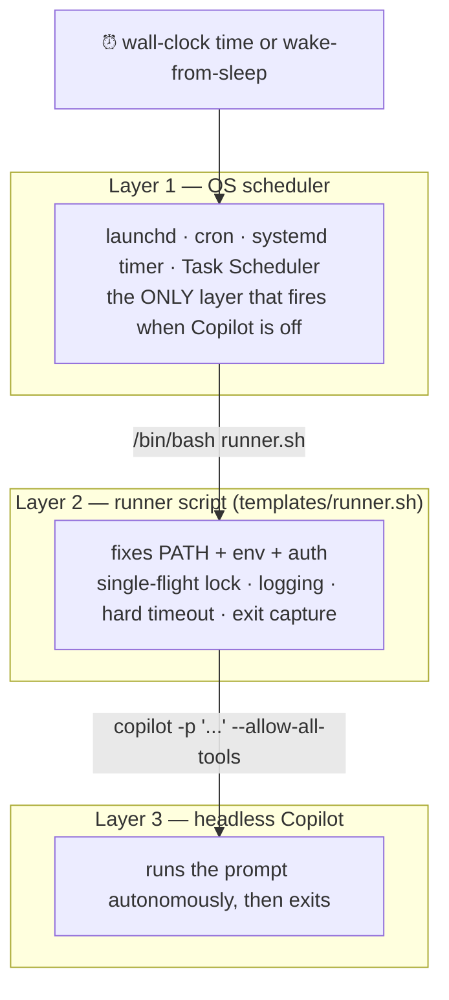
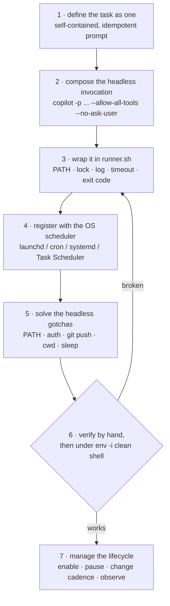
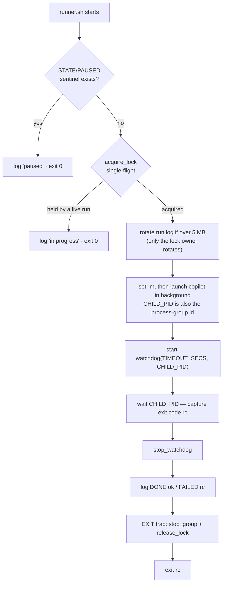
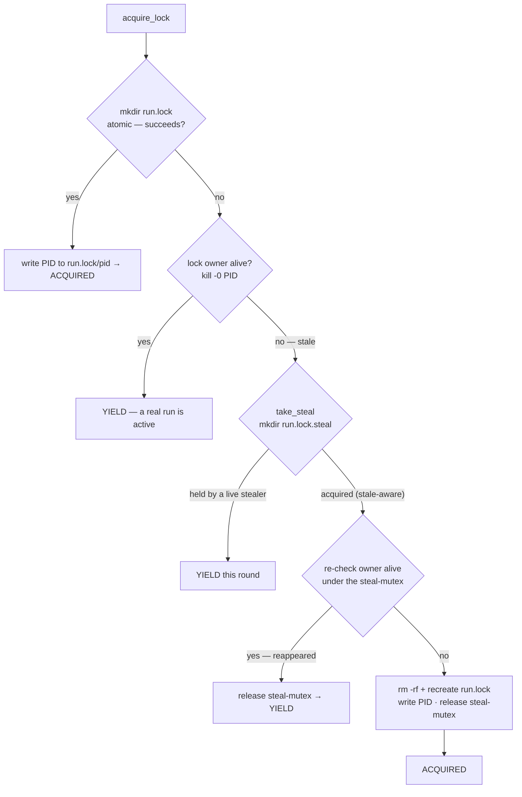
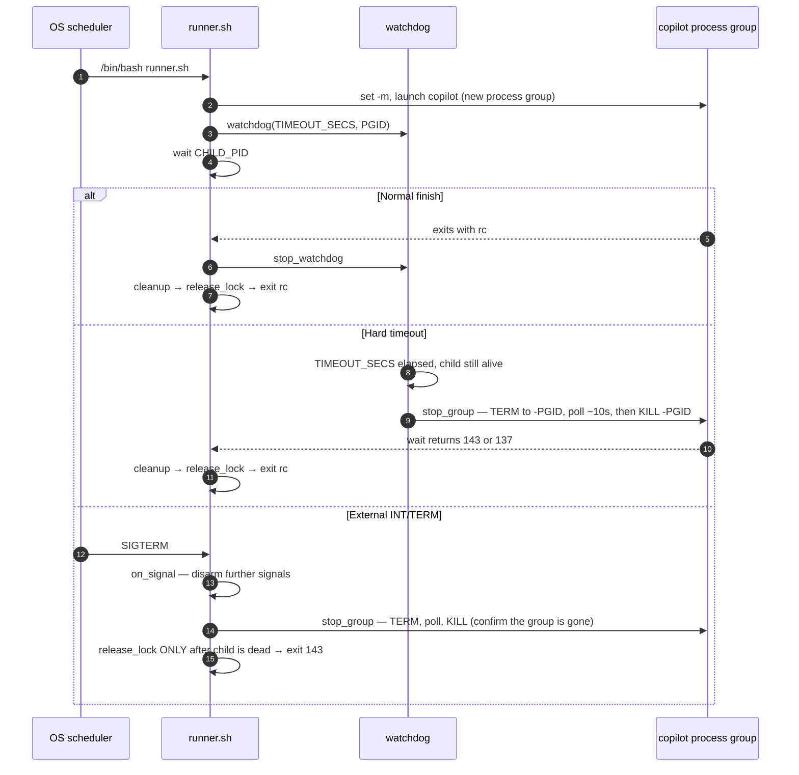

# Scheduled Headless Copilot

Run a Copilot CLI task **on a clock — unattended, with no session or terminal open** — by
driving a headless `copilot -p` run from an OS-level scheduler (launchd, cron, systemd timer, or
Windows Task Scheduler).

This is the human-facing tour of the skill. The agent-facing procedure lives in
[`SKILL.md`](./SKILL.md); the deep detail lives under [`references/`](./references); the
copy-and-edit artifacts live under [`templates/`](./templates).

---

## The gap it fills

Copilot's in-session `/every` command is **session-bound**: it only ticks while a Copilot
session stays alive and stops the instant you quit. To run *when Copilot is off* — overnight, on
a schedule, after the laptop wakes — you need an **OS scheduler** that launches Copilot
headlessly.



> `scheduled-skill-review` (also in this plugin) is one concrete, shipped implementation of this
> exact pattern. This skill is the **reusable recipe** for building any other scheduled task.

---

## Copilot Loops for macOS

**Copilot Loops** is the native macOS 13+ manager for this workflow. It adds a menu-bar
companion and full SwiftUI app for:

- building headless Copilot loops with a plugin, agent, skill, and prompt
- running executable scripts or binaries with explicit argument arrays
- scheduling with launchd while the app is closed
- reviewing permissions and Keychain-backed secret names before enabling
- monitoring live output, upcoming runs, skips, failures, retries, and history

Install it from this skill directory:

```bash
bash scripts/loops-install.sh
```

See [`references/copilot-loops-app.md`](./references/copilot-loops-app.md) for the complete
setup, local identity profile, fail-closed legacy-upgrade gate, operating model, managed
paths, security behavior, and troubleshooting guide. The manual cross-platform workflow
below remains available and is not imported into the app.

---

## How it works — three layers

The scheduler **never calls `copilot` directly**. It always launches a **runner script**, which
rebuilds the sane environment the scheduler strips away, then invokes headless Copilot.



**Why the middle layer exists:** schedulers start jobs with a stripped-down environment — a
minimal `PATH`, no interactive shell, no keychain prompt, and a working directory of `/` or
`$HOME`. The runner is where you make the environment deterministic and debuggable, and it is the
exact thing you test by hand before trusting the clock.

---

## Setup at a glance

The [`SKILL.md`](./SKILL.md) procedure is seven steps. Verification loops back to the runner
until a hand-run under a clean shell succeeds:



---

## Quick start (macOS / launchd)

```bash
TASK=copilot-task
STATE="$HOME/.copilot/scheduled-tasks/$TASK"
mkdir -p "$STATE/cli-logs"

# 1. Copy the runner and edit the CONFIG block (REPO, PROMPT, TIMEOUT_SECS, ...)
cp templates/runner.sh "$STATE/runner.sh"

# 2. Prove the task works BEFORE scheduling it — first directly, then under a
#    scheduler-like clean environment (this catches PATH/auth gaps that only appear unattended).
bash "$STATE/runner.sh"
env -i HOME="$HOME" PATH="/opt/homebrew/bin:/usr/bin:/bin" bash "$STATE/runner.sh"

# 3. Copy the LaunchAgent, replace USERNAME + set the time, then load it.
cp templates/com.example.copilot-task.plist ~/Library/LaunchAgents/com.example.copilot-task.plist
#    ...edit absolute paths (launchd does NOT expand ~ or $HOME) and StartCalendarInterval...
launchctl load  ~/Library/LaunchAgents/com.example.copilot-task.plist
launchctl list | grep com.example.copilot-task     # verify it is loaded

# Pause without unscheduling:   touch "$STATE/PAUSED"
# Hard stop:                    launchctl unload ~/Library/LaunchAgents/com.example.copilot-task.plist
```

For cron, systemd timers, and Windows Task Scheduler, see
[`references/schedulers.md`](./references/schedulers.md).

---

## Inside the runner

[`templates/runner.sh`](./templates/runner.sh) is deliberately defensive — it is the piece that
runs unattended at 3 a.m. with nobody watching. It targets stock macOS **bash 3.2** (no
`wait -n`, no `flock`, no `timeout`) and guarantees three things: **at most one run at a time**,
**a hard wall-clock cap on the whole process tree**, and **the lock is never released while a
child is still dying**.

### Execution flow



### Single-flight locking (airtight under races)

The lock is an atomic `mkdir run.lock`. The hard part is a **stale** lock left by a crashed run:
two jobs that both notice the dead owner must not *each* recreate the lock and double-run. A
second **steal-mutex** serializes the reclaim so exactly one job ever rebuilds the lock. This
path was stress-tested with 16 concurrent racer pairs against a pre-planted stale lock — **zero
double-runs**.



### Timeout and shutdown

`copilot` is launched under `set -m`, so it becomes its own **process-group leader**. Every
termination path signals the whole **negative-PID group** — reaping Copilot *and* any children it
spawned — and each signal is guarded by a fresh `kill -0` so a reused PID is never hit. External
`INT`/`TERM` (from `launchctl unload`, `systemctl stop`, or a manual kill) **confirms the child
group is gone before releasing the lock**, so the next scheduled fire can never overlap a
still-dying run.



---

## What's in this skill

```text
scheduled-headless-copilot/
├── SKILL.md                              # managed-app and manual scheduling procedure
├── README.md                             # you are here
├── references/
│   ├── copilot-loops-app.md              # app setup, security, lifecycle, and troubleshooting
│   ├── schedulers.md                     # launchd / cron / systemd / Task Scheduler registration
│   └── headless-invocation.md            # flags, auth, PATH, and troubleshooting
├── scripts/
│   ├── loops-ctl.mjs                     # JSON control plane
│   ├── loops-runner.mjs                  # managed per-loop runner
│   ├── loops-app/                        # native SwiftUI app and Keychain helper
│   └── loops-{build,install,uninstall}.sh
└── templates/
    ├── runner.sh                         # hardened manual Bash 3.2 runner
    └── com.example.copilot-task.plist    # manual macOS LaunchAgent template
```

---

## Choosing a scheduler

| Platform | Tool | Fires after a missed slot? | Notes |
|---|---|---|---|
| **macOS** | launchd LaunchAgent | ✅ once on wake | Primary path; per-user, no root. `~`/`$HOME` are **not** expanded — use absolute paths. |
| **Linux** | cron | ❌ skips if off/asleep | Simplest; add `anacron` or a systemd timer for catch-up. |
| **Linux** | systemd user timer | ✅ with `Persistent=true` | Structured `journalctl` logs; needs `loginctl enable-linger` to run while logged out. |
| **Windows** | Task Scheduler | ✅ with "run if missed" | Register "run whether user is logged on or not" for true unattended runs. |

Full syntax and a cadence cheat-sheet are in
[`references/schedulers.md`](./references/schedulers.md).

---

## When to use — and when not

**Use this skill when** you want a `copilot -p` task to run on a schedule with no session open:
nightly triage, audits, reports, digests, or maintenance — or to promote a working one-off
`copilot -p` command into a durable scheduled job.

**Skip it when:**

- You only need recurrence **while a session stays open** → use the in-session `/every` command.
- You want the ready-made *\* self-review daemon* → use `scheduled-skill-review`.
- You need **event-driven** automation inside a running session (gate a tool call, inject
  context, notify on stop) → use `hooks-crafting` (`hooks.json`), not a scheduler.
- It is a genuine **one-off** → just run `copilot -p "..." --allow-all-tools` by hand.

---

## Learn more

- [`SKILL.md`](./SKILL.md) — the full step-by-step procedure and a worked nightly-audit example.
- [`references/headless-invocation.md`](./references/headless-invocation.md) — every flag/env var
  that matters unattended, how auth resolves, non-interactive git/`gh`, and a failure→fix matrix.
- [`references/schedulers.md`](./references/schedulers.md) — per-platform registration and cadence
  recipes.
